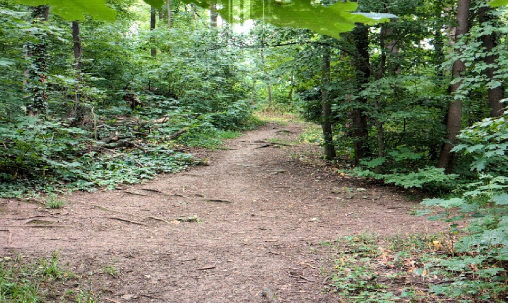
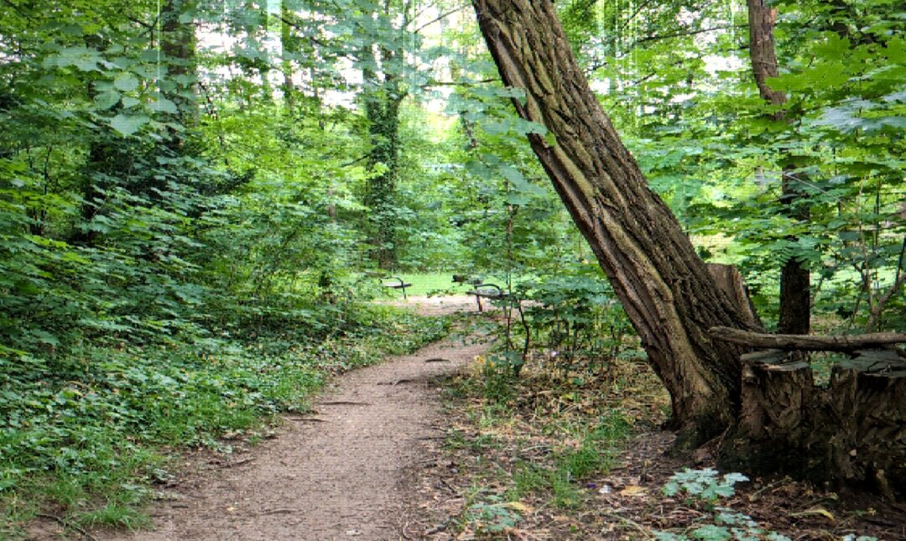
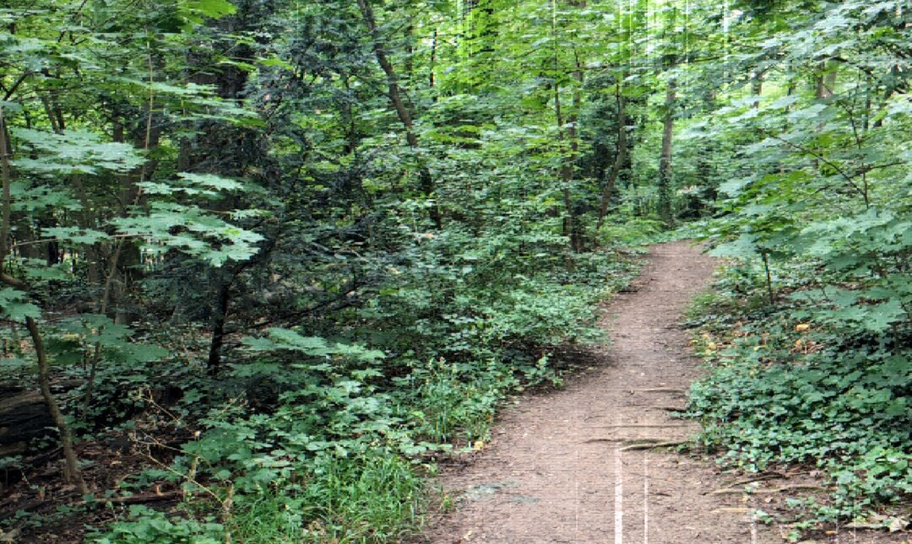
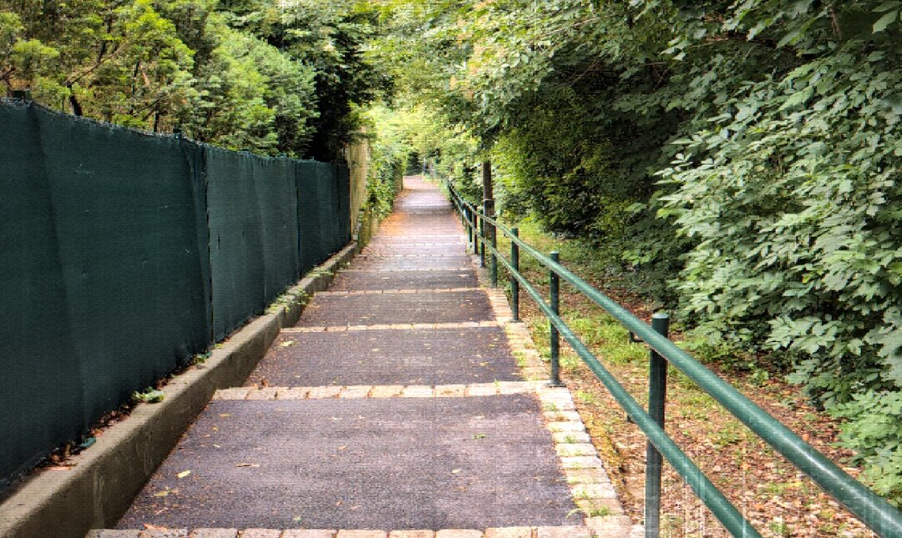
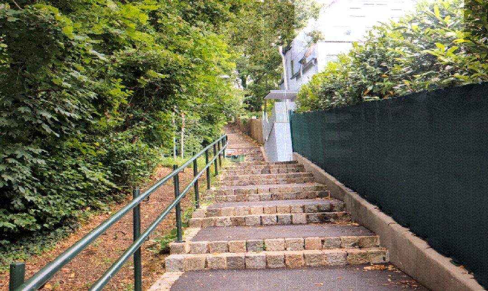
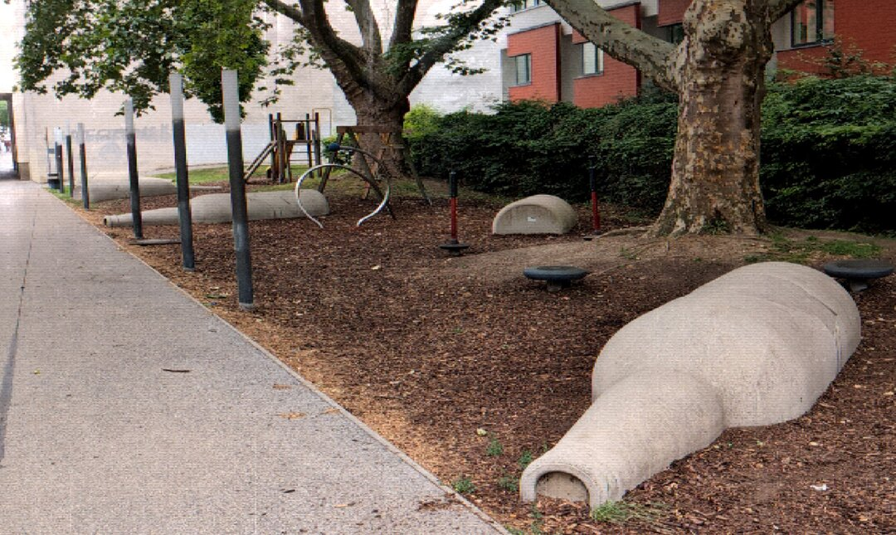
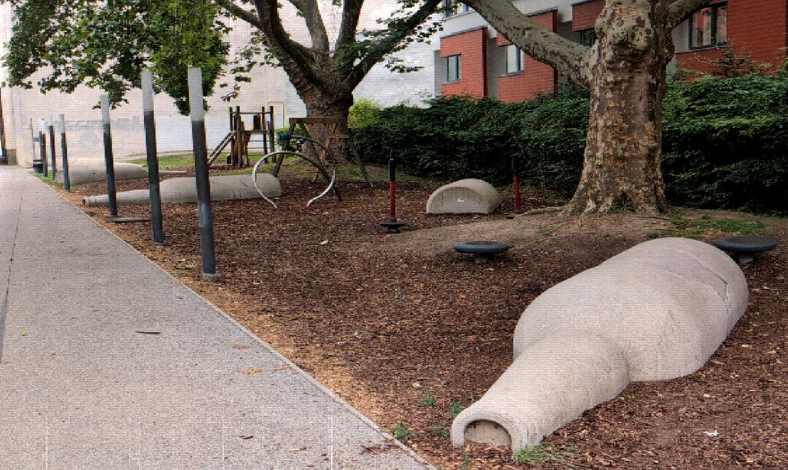
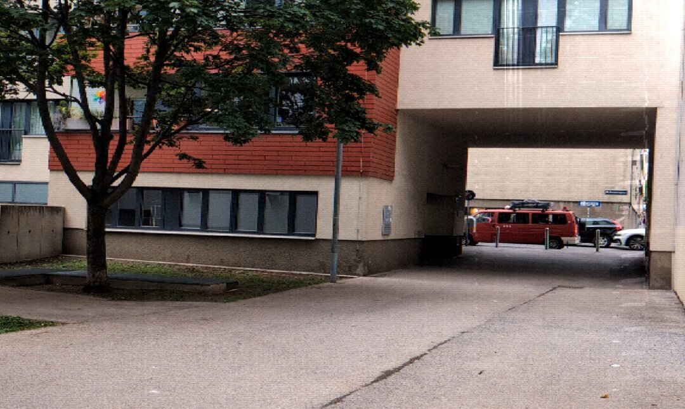
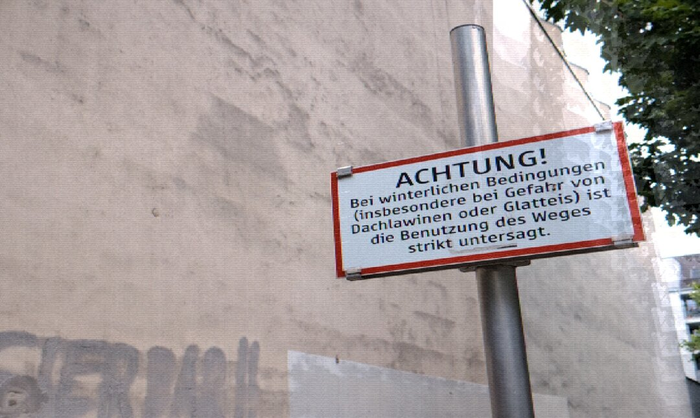
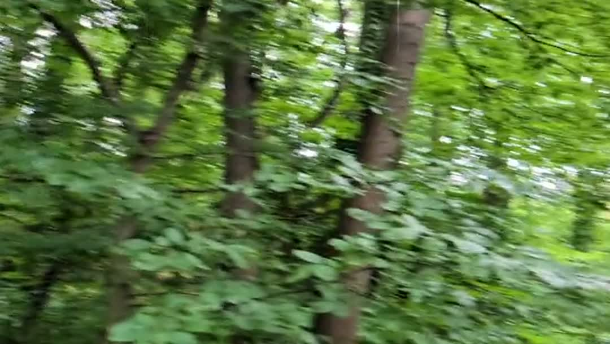

# CCDCam

Open-source camcorder filter app for Android. The live camera feed runs through a GLSL fragment shader that fakes the look of a 90s Sony Handycam / Hi8 / MiniDV: chunky low-res chroma, vertical highlight smear, horizontal flare, scanlines, warm grade, vignette. Photos and video are saved with the filter baked into the pixels.

## Examples

Forest, shot on a Pixel through CCDCam:

<p>
  
  
  
</p>
<p>
  
  
</p>
<p>
  
  
  
  
</p>

<p>
  <a href="docs/examples/forest.mp4" title="Click to play (opens GitHub video viewer)">
    
  </a>
</p>

## Features

- **Live filtered preview** at full display refresh rate (60-120 fps)
- **Photo mode** — single JPEG snapshot of the filtered frame, saved to `Pictures/CCDCam/`
- **Video mode** — H.264 MP4 + AAC audio, filter baked in via a MediaCodec dual-render pipeline, saved to `Movies/CCDCam/`
- **Pinch-to-zoom** clamped to the lens's min/max
- **Camcorder HUD overlay**: corner viewfinder brackets, `HH:MM:SS:FF` timecode, `STBY`/`REC` indicator with blinking red dot, tape mode label, battery icon, live date stamp
- **Material You adaptive icon** with a monochrome layer that picks up the system wallpaper color on Android 13+
- **Front/back camera flip**
- **Python sim** (`tools/sim.py`) — numpy reimplementation of the shader so you can iterate the look on a JPEG or MP4 without rebuilding the APK

## What the shader does

`app/src/main/assets/shaders/ccd.frag`, in order:

1. UV quantization to a 540×480 cell grid → GPU bilinear inside each cell + cell-center sampling reproduces a `downsample-then-nearest-upsample` Hi8 chunkiness without an offscreen pass
2. Chroma shift on R/B sampling for NTSC color bleed
3. Vertical CCD smear — bright pixels bleed up and down their column
4. Horizontal flare around extreme highlights
5. Per-frame chroma noise on R and B
6. Luma grain
7. Black lift + warm grade + slight desaturation
8. Scanline modulation tied to vertical line count
9. Radial vignette

All constants are at the top of the file; tuning the look is a one-liner. The same constants live in `tools/sim.py` so changes can be previewed in Python before rebuilding.

## Architecture

- **CameraX 1.4** drives the `Preview` use case into a custom `SurfaceTexture` (CameraX `VideoCapture` is intentionally not used — it would bypass the shader)
- **`CcdRenderer`** is a `GLSurfaceView.Renderer` that draws the shader-filtered scene to the on-screen surface every frame, and to an optional second `EGLSurface` backed by `MediaCodec`'s input Surface when recording (throttled to a steady 30 fps for clean encoder timing)
- **`VideoRecorder`** wraps the H.264 encoder + AAC encoder (`AudioRecord` → `MediaCodec` AAC) and a shared `MediaMuxer`. Both tracks use the same `startNs` reference so the muxed MP4 reports a correct duration
- **Photo capture** does a `glReadPixels` of the display framebuffer the next frame after `requestFrameSnapshot`, Y-flips the bitmap, writes JPEG via `MediaStore`

## Install

Latest pre-built APK is on the [Releases page](https://github.com/sturq/ccdcam/releases) (signed with the bundled debug keystore so installs require allowing unknown sources). Once published, F-Droid will be the recommended install channel.

To build locally:

```
./gradlew assembleDebug   # debug APK
./gradlew assembleRelease # release APK signed with bundled debug keystore
```

CI builds every push and produces release APKs on `v*` tags via `.github/workflows/release.yml`.

## Tweaking the look

Edit the constants at the top of `app/src/main/assets/shaders/ccd.frag`. The same values must be mirrored in `tools/sim.py` (kept in sync by hand). Run the sim on a sample frame:

```
python tools/sim.py input.jpg output.jpg
python tools/sim.py input.mp4 output.mp4   # requires ffmpeg
python tools/test_sim.py                   # 8 invariants the shader has to satisfy
```

## License

[GPL-3.0-only](LICENSE). If you distribute a fork or use this code in another project, your project has to be under GPL-3.0 (or a compatible license) and you have to make your source available to users. The Hi8 look should stay free for everyone.
